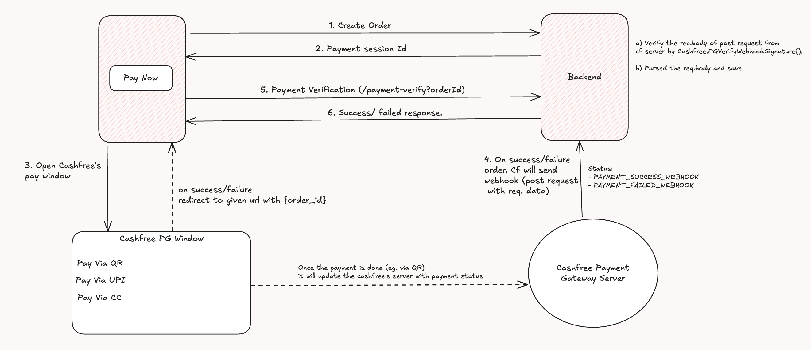

# AWS Deployment - EC2 Instance - Ubuntu

- Frontend

  - npm install -> dependencies install
  - npm run build
  - sudo apt update
  - sudo apt install nginx (Nginx is highly efficient at serving static files, and it does so with minimal overhead, making it an ideal choice for hosting these files.)
  - sudo systemctl start nginx
  - sudo systemctl enable nginx
  - Copy code from dist(build files) to /var/www/html/ -> sudo scp -r dist/\* /var/www/html/
  - Enable port :80 of your instance from AWS (use http)

- Backend
  - allowed ec2 instance public IP on mongodb server - from Atlas site
  - npm install pm2 -g (Process management library which will help to run node in background)
  - pm2 start npm --name "devTinder-backend" -- start (it will start the node server via pm2 with given name ).
  - pm2 logs
  - pm2 list, pm2 flush <name> , pm2 stop <name>, pm2 delete <name>
  - config nginx -> `/etc/nginx/sites-available/default`
  - restart nginx -> `sudo systemctl restart nginx`
  - Modify the BASEURL in frontend project to "/api"
  - to restart pm2 -> pm2 restart <id>

# Ngxinx config (for Proxy Pass):

```
    Frontend = http://http://13.126.4.135/
    Backend = http://http://13.126.4.135:7777/

    Domain name = devtinder.com => 13.126.4.135

    Frontend = devtinder.com
    Backend = devtinder.com:7777 => devtinder.com/api

    nginx config :

    server_name 43.204.96.49;

    # when the path is  /api/ it will serve it as http://localhost:7777/
    location /api/ {
        proxy_pass http://localhost:7777/;  # Pass the request to the Node.js app
        proxy_http_version 1.1;
        proxy_set_header Upgrade $http_upgrade;
        proxy_set_header Connection 'upgrade';
        proxy_set_header Host $host;
        proxy_cache_bypass $http_upgrade;
    }

    location / {
        # Try to serve the request as a file, or fallback to index.html
        try_files $uri $uri/ /index.html;
    }
```

# Payment Gateway HLD:



# Socket.io:

- low-latency, bidrectional and event-based


## Prettier Setup Guide

### Installation Steps

1. **Install Required Packages**

   ```bash
   npm install --save-dev prettier husky lint-staged
   ```

   - `prettier`: The code formatter
   - `husky`: For Git hooks
   - `lint-staged`: For running commands on staged files

2. **Create Prettier Configuration Files**

   Create a `.prettierrc` file in your project root:

   ```json
   {
     "semi": true,
     "tabWidth": 2,
     "printWidth": 100,
     "singleQuote": false,
     "trailingComma": "es5",
     "bracketSpacing": true,
     "jsxBracketSameLine": false,
     "arrowParens": "always",
     "endOfLine": "lf"
   }
   ```

   Create a `.prettierignore` file to exclude certain files:

   ```
   # Build outputs
   dist
   build
   coverage

   # Package manager files
   node_modules
   package-lock.json
   yarn.lock
   pnpm-lock.yaml

   # Misc
   .DS_Store
   .env
   .env.local
   .env.development.local
   .env.test.local
   .env.production.local
   ```

3. **Update package.json**

   Add the following scripts and configuration to your `package.json`:

   ```json
   "scripts": {
     "format": "prettier --write \"src/**/*.{js,jsx,ts,tsx,json,css,scss,md}\"",
     "format:check": "prettier --check \"src/**/*.{js,jsx,ts,tsx,json,css,scss,md}\"",
     "prepare": "husky"
   },
   "lint-staged": {
     "src/**/*.{js,jsx,ts,tsx}": [
       "prettier --write",
       "eslint --fix"
     ],
     "src/**/*.{json,css,scss,md}": [
       "prettier --write"
     ]
   }
   ```

4. **Set Up Husky**

   Initialize Husky:

   ```bash
   npx husky init
   ```

   Create a pre-commit hook:

   ```bash
   mkdir -p .husky
   ```

   Create a `.husky/pre-commit` file:

   ```bash
   #!/usr/bin/env sh
   . "$(dirname -- "$0")/_/husky.sh"

   # Run lint-staged to format and lint files
   npx lint-staged
   ```

   Make the pre-commit hook executable:

   ```bash
   chmod +x .husky/pre-commit
   ```

   Run the prepare script:

   ```bash
   npm run prepare
   ```

### How It Works

1. When you try to commit changes to GitHub, the pre-commit hook will automatically run.
2. The hook will execute lint-staged, which will:
   - Run Prettier to format all staged JavaScript and JSX files
   - Run ESLint to fix any linting issues
   - Format other file types (JSON, CSS, etc.) with Prettier
3. If any files are modified during this process, they will be automatically added to your commit.
4. If there are any errors that can't be automatically fixed, the commit will be aborted, and you'll need to fix them manually.

### Manual Usage

You can also run these commands manually:

- `npm run format`: Format all files in the src directory
- `npm run format:check`: Check if files are formatted correctly without modifying them

### Troubleshooting

If you encounter any issues:

1. Make sure all required packages are installed
2. Check that the pre-commit hook is executable
3. Verify that your `.prettierrc` and `.prettierignore` files are correctly configured
4. Run `npm run format` manually to see if there are any formatting errors

This setup ensures that all code committed to your repository is consistently formatted according to your Prettier configuration, which helps maintain code quality and readability across your project.
